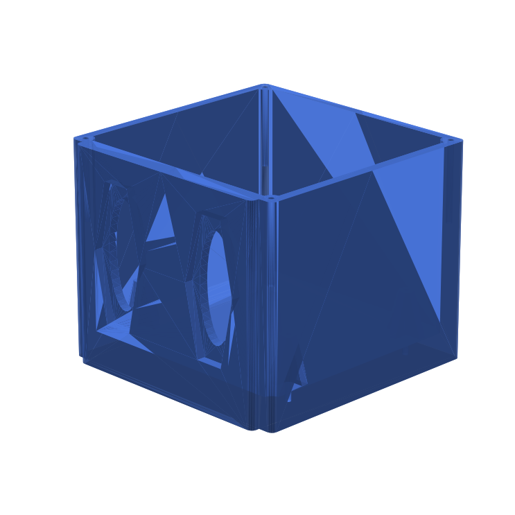

<p align="center">
  
</p>

<h1 align="center">AMR1-TEC-CORE</h1>
<p align="center">
  <strong>Plataforma de investigación para robótica móvil autónoma</strong>
</p>

<p align="center">
  <a href="#-descripción">Descripción</a> •
  <a href="#-estructura-del-proyecto">Estructura</a> •
  <a href="#-hardware">Hardware</a> •
  <a href="#-software">Software</a> •
  <a href="#-pcb--esquemáticos">PCB</a> •
  <a href="#-modelos-3d">3D</a> •
  <a href="#-guía-rápida">Guía Rápida</a>
</p>

<p align="center">
  <a href="https://github.com/AMR-Autonomy-and-Research-Lab/amr1-tec-core/actions">
    
  </a>
  <a href="https://github.com/AMR-Autonomy-and-Research-Lab/amr1-tec-core/actions/workflows/pcb-validation.yml">
    
  </a>
  <a href="https://github.com/AMR-Autonomy-and-Research-Lab/amr1-tec-core/actions/workflows/pcb-manufacturing.yml">
    
  </a>
  <a href="https://github.com/AMR-Autonomy-and-Research-Lab/amr1-tec-core/actions/workflows/pcb-easyeda-lint.yml">
    
  </a>
  <a href="https://github.com/AMR-Autonomy-and-Research-Lab/amr1-tec-core/actions/workflows/pcb-preview.yml">
    
  </a>
  <a href="https://github.com/AMR-Autonomy-and-Research-Lab/amr1-tec-core/actions/workflows/pcb-bom-check.yml">
    
  </a>
  <a href="https://github.com/AMR-Autonomy-and-Research-Lab/amr1-tec-core/actions/workflows/3d-validation.yml">
    
  </a>
  <a href="https://github.com/AMR-Autonomy-and-Research-Lab/amr1-tec-core">
    
  </a>
  <a href="https://github.com/AMR-Autonomy-and-Research-Lab/amr1-tec-core/blob/main/LICENSE">
    
  </a>
</p>

---

## 📋 Descripción

**AMR1-TEC-CORE** es una plataforma integral para el desarrollo e investigación en robótica móvil autónoma (AMR). Integra percepción, navegación, control y sistemas embebidos en un único ecosistema experimental.

El proyecto incluye:

- **Control de actuadores vía CAN** (500 kbps) con protocolo Serial → CAN
- **Sistema de frenos** con actuador lineal Pololu Glideforce y lazo cerrado
- **PCB personalizado** diseñado en EasyEDA, listo para manufactura
- **Modelos 3D** para carcasa y componentes mecánicos
- **Firmware** para Adafruit Feather RP2040 CAN (TX/RX)

---

## 📁 Estructura del Proyecto

```
amr1-tec-core/
├── 📂 PCB_Design/              # Diseño electrónico
│   ├── PCB_AMR_Esquematico.json   # Esquemático eléctrico (EasyEDA)
│   ├── PCB_Final.json             # Pistas y conexiones
│   ├── PCB_Actualizada_AMR.json   # Versión actualizada
│   └── PCB_AMR_Gerber/           # Archivos Gerber para manufactura
│       ├── Gerber_*.GTL/.GBL     # Capas cobre
│       ├── Gerber_*.GTS/.GBS     # Máscara de soldadura
│       ├── Gerber_*.GTO/.GBO     # Serigrafía
│       ├── Gerber_*.GKO          # Contorno de placa
│       └── Drill_*.DRL           # Taladros
│
├── 📂 feather_can_tx/           # Transmisor Serial→CAN
│   └── feather_can_tx.ino       # Comandos: B/D/M, emergencia, setpoint
│
├── 📂 feather_can_rx/           # Receptor CAN→Motor
│   └── feather_can_rx.ino       # Control Pololu, freno, OLED
│
├── 📂 Diseño_CAJA/              # Modelos 3D para impresión
│   └── CajaNuevaAMRF2.STL       # Carcasa del AMR (casi final)
│
├── 📂 3D_Models/                # Espacio para modelos adicionales 3D
│
├── .github/workflows/           # GitHub Actions (CI/CD)
├── README.md
└── LICENSE
```

---

## 🔧 Hardware

### Placa base
- **Adafruit Feather RP2040 CAN** (MCP2515, 500 kbps)
- Comunicación CAN para distribución de control

### Actuador
- **Pololu Glideforce High-Speed LD** — 12 kgf, carrera 6", 12V
- PWM (D6) + DIR (D9) + FLT (D5) + sensor de corriente (A3)
- Potenciómetro feedback pistón (A0)

### Display
- **SSD1306** 128×64 I2C (0x3C)

### IDs CAN (protocolo)
| ID    | Función            | Descripción                          |
|-------|--------------------|--------------------------------------|
| 0x200 | Setpoint freno     | Posición objetivo actuador (0–100)  |
| 0x201 | Feedback freno     | Posición actual del pistón           |
| 0x210 | Emergencia         | 1=ir a 0%, 0=modo normal            |
| 0x53  | Dirección          | 1 byte                              |
| 0x54  | Motor              | 5 bytes (vel, en, rev, lo, hi)      |
| 0x30  | Vista OLED         | 1=CAN addr, 2=Pololu                 |

---

## 💻 Software

### Dependencias (Arduino)

Instala las siguientes librerías desde el Library Manager:

- **Adafruit MCP2515** — Controlador CAN
- **Adafruit GFX**
- **Adafruit SSD1306** — Pantalla OLED

### feather_can_tx — Comandos Serial → CAN

```bash
# Baudrate Serial: 115200
# Comandos:
B 50        # Setpoint freno 50% (0x200)
E 1         # Emergencia ON (actuador → 0%)
E 0         # Emergencia OFF
D 75        # Dirección (0x53)
M 100 1 0 0 0   # Motor: vel, enable, reverse, lo, hi
1 / 2       # Cambiar vista OLED en RX (1=CAN, 2=Pololu)
200 85      # Formato YRA: ID + porcentaje
? / help    # Ayuda
```

### feather_can_rx — Receptor y control

- Recibe mensajes CAN y aplica a motor/actuador
- Control de frenos con lazo cerrado (setpoint vs potenciómetro)
- Feedback posición por 0x201
- OLED con 2 vistas: dirección CAN o datos Pololu (PWM, DIR, I, FLT)

---

## 🔌 PCB y Esquemáticos

| Archivo                  | Descripción                        |
|-------------------------|------------------------------------|
| `PCB_AMR_Esquematico.json` | Diagrama eléctrico (EasyEDA)   |
| `PCB_Final.json`        | Pistas y conexiones               |
| `PCB_AMR_Gerber/`       | Gerbers listos para fabricación   |

### Vista previa PCB

<p align="center">
  <a href="https://amr1-tec-core.vercel.app">
    
  </a>
</p>
<p align="center">
  <small>Mapa interactivo generado automáticamente desde EasyEDA. Permite inspeccionar capas, buscar componentes (ej: "R1") y ver ruteo para facilitar el ensamblaje.</small>
</p>

- **SVG/Preview:** Descarga el artifact `pcb-preview-svg` del workflow [PCB Preview](https://github.com/AMR-Autonomy-and-Research-Lab/amr1-tec-core/actions/workflows/pcb-preview.yml) en Actions
- **Vista 3D del PCB:** Exporta desde EasyEDA (File → Exportar → 3D Model) y sube el `.obj` o `.stl` para visualizarlo aquí

### Cómo fabricar la placa

1. Abre [EasyEDA PCB Order](https://docs.easyeda.com/en/PCB/Order-PCB)
2. Sube los archivos de `PCB_AMR_Gerber/`
3. Selecciona parámetros (espesor, acabado, etc.)

Los archivos Gerber incluyen:
- Capas superior/inferior
- Máscaras de soldadura
- Serigrafía
- Taladros (PTH, NPTH, vías)

---

## 🎨 Modelos 3D

La carpeta `Diseño_CAJA/` contiene la base/carcasa para montaje de PCB y modelos STL para impresión 3D:

| Archivo             | Descripción                        |
|---------------------|------------------------------------|
| `CajaNuevaAMRF2.STL`| Carcasa principal AMR (base para PCB) |

### Vista previa — Carcasa (Diseño_CAJA)

<p align="center">
  <strong>CajaNuevaAMRF2</strong> · Base para montaje de PCB
</p>

<p align="center">
  
</p>

<p align="center">
  <a href="https://github.com/AMR-Autonomy-and-Research-Lab/amr1-tec-core/blob/main/Dise%C3%B1o_CAJA/CajaNuevaAMRF2.STL">
    <strong>▶ Ver modelo 3D interactivo en GitHub</strong>
  </a>
  <br><small>(Haz clic en el enlace para rotar, hacer zoom y explorar el STL)</small>
</p>

<p align="center">
  <a href="https://htmlpreview.github.io/?https://raw.githubusercontent.com/AMR-Autonomy-and-Research-Lab/amr1-tec-core/main/docs/caja_viewer.html">
    
  </a>
</p>

<p align="center">
  <small>Arrastra para rotar · Scroll para zoom in/out · Clic derecho para pan</small>
</p>

<p align="center">
  <a href="https://github.com/AMR-Autonomy-and-Research-Lab/amr1-tec-core/blob/main/Dise%C3%B1o_CAJA/CajaNuevaAMRF2.STL">📥 Descargar STL</a>
</p>


Compatible con:
- Cura, PrusaSlicer, Simplify3D
- Impresoras FDM estándar

---

## ⚙️ CI/CD — GitHub Actions

| Workflow | Descripción |
|----------|-------------|
| **Arduino Build** | Compila `feather_can_tx` y `feather_can_rx` para Adafruit Feather RP2040 CAN |
| **PCB Validation** | Verifica estructura de Gerbers, JSON EasyEDA, tamaños de archivo |
| **PCB Manufacturing** | Comprueba capas necesarias para JLCPCB/PCBWay |
| **PCB EasyEDA Lint** | Valida esquemático y PCB JSON exportados de EasyEDA |
| **PCB Preview** | Genera SVGs desde Gerbers (tracespace) y sube como artifact |
| **PCB BOM Check** | Extrae componentes del esquemático para revisión de BOM |

---

## 🚀 Guía Rápida

### 1. Clonar

```bash
git clone https://github.com/AMR-Autonomy-and-Research-Lab/amr1-tec-core.git
cd amr1-tec-core
```

### 2. Compilar firmware

- Abre Arduino IDE
- Selecciona placa: **Adafruit Feather RP2040 CAN**
- Abre `feather_can_tx/feather_can_tx.ino` o `feather_can_rx/feather_can_rx.ino`
- Compila y sube

### 3. Probar TX

```bash
# Conecta por Serial (115200)
# Envía: B 50
# Verifica LED y OLED en RX
```

---

## 🤝 Contribuir

1. Fork el repositorio
2. Crea una rama (`git checkout -b feature/nueva-funcionalidad`)
3. Commit (`git commit -m 'Añade X'`)
4. Push (`git push origin feature/nueva-funcionalidad`)
5. Abre un Pull Request

---

## 📄 Licencia

Este proyecto está bajo la licencia **MIT**. Ver [LICENSE](LICENSE) para más detalles.

---

<p align="center">
  <strong>AMR Autonomy and Research Lab</strong> · Tec de Monterrey
</p>
