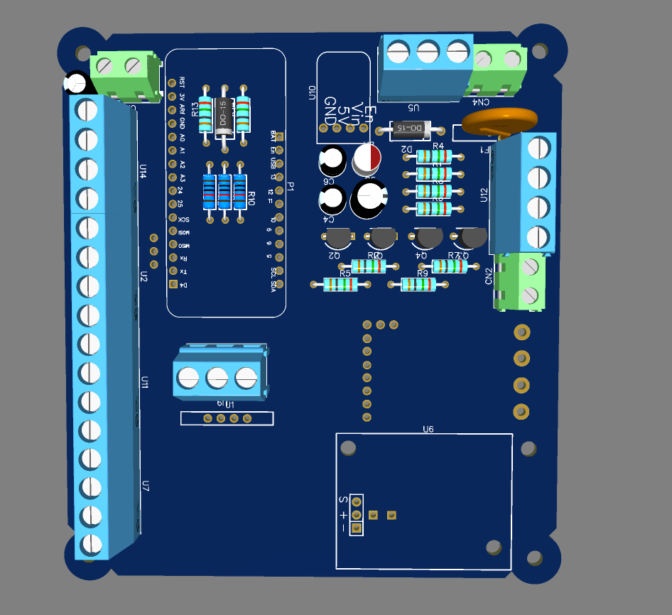

<div align="center">

<br/>


<br/><br/>

# AMR1-TEC-CORE

### Plataforma de Control Hardware para Robótica Móvil Autónoma

<br/>

[](LICENSE)
[](https://www.adafruit.com/product/5709)
[](https://en.wikipedia.org/wiki/CAN_bus)
[](https://easyeda.com)
[](https://www.autodesk.com/products/fusion-360)

<br/>

> PCB personalizada que unifica percepción, control de actuadores en lazo cerrado, distribución de bus CAN y telemetría en tiempo real en una sola tarjeta — diseñada con estándares de producción para investigación en robótica autónoma en el Tec de Monterrey.

<br/>

</div>

---

## Visor 3D Interactivo de la PCB

<div align="center">

<br/>

**Haz clic en la imagen para abrir el visor 3D completo en tu navegador — sin instalación, renderizado directo con WebGL.**

<br/>

<a href="https://htmlpreview.github.io/?https://raw.githubusercontent.com/AMR-Autonomy-and-Research-Lab/amr1-tec-core/main/docs/hardware/3d_viewer/index.html">
  
</a>

<br/><br/>

<a href="https://htmlpreview.github.io/?https://raw.githubusercontent.com/AMR-Autonomy-and-Research-Lab/amr1-tec-core/main/docs/hardware/3d_viewer/index.html">
  
</a>
&nbsp;&nbsp;
<a href="https://htmlpreview.github.io/?https://raw.githubusercontent.com/AMR-Autonomy-and-Research-Lab/amr1-tec-core/main/docs/hardware/ibom_final.html">
  
</a>

<br/><br/>

| Herramienta | Tecnología | Para qué sirve |
|:-----------:|:----------:|:---------------|
| **Visor 3D** | WebGL · Three.js | Inspección visual, renders, verificación geométrica |
| **Mapa iBOM** | HTML interactivo | Guía de soldadura, localización de componentes |

<br/>

</div>

---

## Galería de la PCB

<div align="center">

> Guarda tus renders en `docs/hardware/images/` para que aparezcan aquí automáticamente.

<!-- Descomenta cuando tengas los renders guardados:

### Render 3D
<a href="https://htmlpreview.github.io/?https://raw.githubusercontent.com/AMR-Autonomy-and-Research-Lab/amr1-tec-core/main/docs/hardware/3d_viewer/index.html">
  
</a>
<sub><i>↑ Clic en la imagen para abrir el visor 3D interactivo</i></sub>

### Ruteo de la PCB


### Esquemático


-->

</div>

---

## Especificaciones Técnicas

<div align="center">

### Control Central y Comunicaciones

| Parámetro | Valor |
|-----------|-------|
| Microcontrolador | Adafruit Feather RP2040 CAN |
| Controlador CAN | MCP2515 (SPI) |
| Velocidad Bus CAN | 500 kbps |
| Entrada Serie | UART 115200 baud |
| Factor de Forma | Compatible Feather |

### Control de Actuador Lineal — Lazo Cerrado

| Parámetro | Valor |
|-----------|-------|
| Actuador | Pololu Glideforce High-Speed LD |
| Carga nominal | 12 kgf |
| Carrera | 6 pulgadas |
| Alimentación | 12 V |
| Control | PWM + Dirección + retroalimentación FLT |
| Sensor de posición | Potenciómetro (ADC) |

### Display de Telemetría a Bordo

| Parámetro | Valor |
|-----------|-------|
| Display | SSD1306 OLED 128×64 |
| Interfaz | I²C |
| Datos mostrados | Estado CAN · Ciclo PWM · Corriente · Diagnóstico FLT |

</div>

---

## Arquitectura del Sistema

```
┌──────────────────────────────────────────────────┐
│                  AMR1-TEC-CORE                   │
│                                                  │
│  Entrada UART (115200 baud)                      │
│         │                                        │
│  ┌──────▼──────────────────┐  ┌───────────────┐  │
│  │   Feather RP2040 CAN    │  │ SSD1306 OLED  │  │
│  │   MCP2515 @ SPI         ├─►│  128×64 I²C   │  │
│  └──────┬──────────────────┘  │  Telemetría   │  │
│         │                     └───────────────┘  │
│    Bus CAN 500 kbps                              │
│         │                                        │
│  ┌──────▼──────────────────┐                     │
│  │  Nodo RX CAN (RP2040)   │                     │
│  └──────┬──────────────────┘                     │
│         │                                        │
│   PWM + DIR + pin FLT                           │
│         │                                        │
│  ┌──────▼──────────────────┐                     │
│  │  Actuador Lineal         │                    │
│  │  Pololu Glideforce LD    │◄── Feedback ADC    │
│  │  12 kgf · 12 V · 6 in   │                    │
│  └──────────────────────────┘                    │
└──────────────────────────────────────────────────┘
```

---

## Estructura del Repositorio

```
amr1-tec-core/
├── PCB_Design/
│   ├── PCB_AMR_Gerber/          # Gerbers validados — listos para fabricación
│   └── PCB_AMR_Gerber.zip       # ZIP directo para JLCPCB o PCBWay
├── 3D_Models/
│   └── PCB_3D/
│       ├── PCB_Final.glb        # Modelo 3D optimizado para el visor WebGL
│       └── OBJ_PCB_Final.obj    # Export OBJ crudo desde EasyEDA
├── feather_can_tx/              # Firmware: Transmisor Serial → CAN
├── feather_can_rx/              # Firmware: Receptor CAN + control de actuadores
├── Diseño_CAJA/                 # Modelos STL de la carcasa protectora
└── docs/hardware/
    ├── ibom_final.html          # Mapa interactivo de componentes (iBOM)
    └── 3d_viewer/
        └── index.html           # Visor WebGL 3D auto-contenido
```

---

## Fabricación de la PCB

Los archivos Gerber están validados y listos para ordenar directamente.

1. Ve a `PCB_Design/PCB_AMR_Gerber/` o descarga `PCB_AMR_Gerber.zip`
2. Sube el ZIP a [JLCPCB](https://jlcpcb.com) o [PCBWay](https://www.pcbway.com)
3. El diseño usa tolerancias comerciales estándar, taladros PTH/NPTH y máscara de soldadura doble capa — sin parámetros especiales

---

<div align="center">
<br/>

Diseñado por el **AMR Autonomy and Research Lab** · Tecnológico de Monterrey

[](LICENSE)

<br/>
</div>
