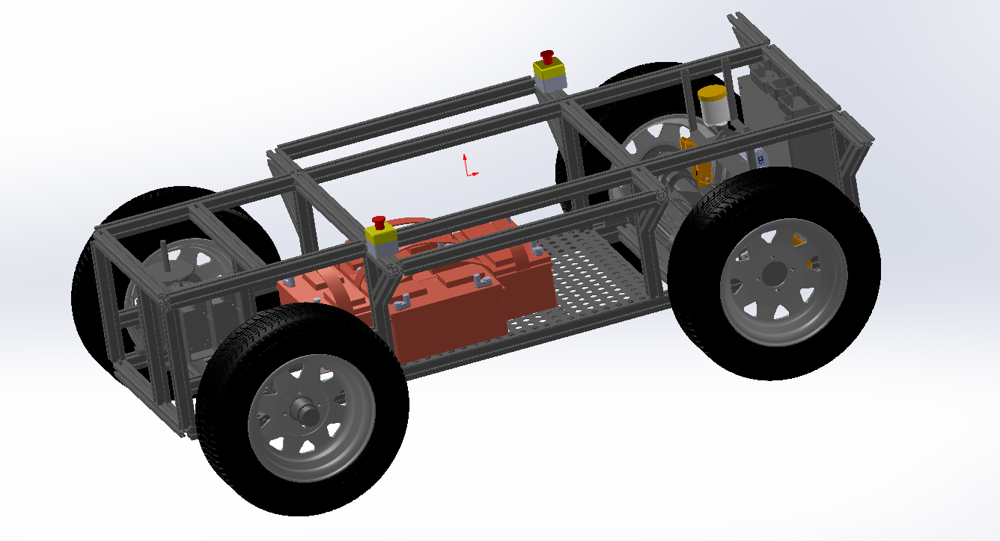

<div align="center">

<br/>


<br/><br/>

# AMR1-TEC-CORE

### Plataforma de Robótica Móvil Autónoma — Hardware + Firmware + CAD

<br/>

[](LICENSE)
[](https://www.adafruit.com/product/5709)
[](https://en.wikipedia.org/wiki/CAN_bus)
[](https://easyeda.com)
[](https://www.solidworks.com)

<br/>

> Plataforma completa de robótica móvil autónoma — incluye diseño CAD del chasis, PCB personalizada con bus CAN, control de actuadores en lazo cerrado y telemetría en tiempo real. Desarrollada con estándares de producción para investigación en el Tec de Monterrey.

<br/>

</div>

---

## Visor 3D del Robot AMR1

<div align="center">

<br/>

**Chasis completo del AMR1 — haz clic para inspeccionar el ensamble 3D en tu navegador.**

<br/>

<a href="https://htmlpreview.github.io/?https://raw.githubusercontent.com/AMR-Autonomy-and-Research-Lab/amr1-tec-core/main/docs/amr1_viewer/index.html">
  
</a>

<br/><br/>

<a href="https://htmlpreview.github.io/?https://raw.githubusercontent.com/AMR-Autonomy-and-Research-Lab/amr1-tec-core/main/docs/amr1_viewer/index.html">
  
</a>

<br/><br/>

</div>

---

## Visor 3D de la PCB + Mapa iBOM

<div align="center">

<br/>

**PCB personalizada AMR1-TEC-CORE — haz clic para abrirla en el visor 3D interactivo.**

<br/>

<a href="https://htmlpreview.github.io/?https://raw.githubusercontent.com/AMR-Autonomy-and-Research-Lab/amr1-tec-core/main/docs/hardware/3d_viewer/index.html">
  
</a>

<br/><br/>

<a href="https://htmlpreview.github.io/?https://raw.githubusercontent.com/AMR-Autonomy-and-Research-Lab/amr1-tec-core/main/docs/hardware/3d_viewer/index.html">
  
</a>
&nbsp;&nbsp;
<a href="https://htmlpreview.github.io/?https://raw.githubusercontent.com/AMR-Autonomy-and-Research-Lab/amr1-tec-core/main/docs/hardware/ibom_final.html">
  
</a>

<br/><br/>

| Herramienta | Tecnología | Descripción |
|:-----------:|:----------:|:------------|
| **Visor 3D Robot** | WebGL · Three.js | Inspección del chasis completo en 3D |
| **Visor 3D PCB** | WebGL · Three.js | Inspección visual y verificación geométrica |
| **Mapa iBOM** | HTML interactivo | Guía de soldadura, localización de componentes |

<br/>

</div>

---

## Especificaciones Técnicas

<div align="center">

### Robot AMR1 — Sistema Completo

| Parámetro | Valor |
|-----------|-------|
| Chasis | Diseño propio en SolidWorks |
| Tracción | 4 ruedas — Motor eléctrico MY1016Z3 |
| Frenado | Sistema hidráulico de pinza (Pololu Glideforce LD) |
| Alimentación | Batería 12 V |
| Control | Feather RP2040 CAN via Bus CAN |
| Comunicación | CAN 500 kbps |

### PCB — Control Central y Comunicaciones

| Parámetro | Valor |
|-----------|-------|
| Microcontrolador | Adafruit Feather RP2040 CAN |
| Controlador CAN | MCP2515 (SPI) |
| Velocidad Bus CAN | 500 kbps |
| Entrada Serie | UART 115200 baud |
| Factor de Forma | Compatible Feather |

### PCB — Control de Actuador Lineal (Lazo Cerrado)

| Parámetro | Valor |
|-----------|-------|
| Actuador | Pololu Glideforce High-Speed LD |
| Carga nominal | 12 kgf |
| Carrera | 6 pulgadas |
| Alimentación | 12 V |
| Control | PWM + Dirección + retroalimentación FLT |
| Sensor de posición | Potenciómetro (ADC) |

### PCB — Display de Telemetría a Bordo

| Parámetro | Valor |
|-----------|-------|
| Display | SSD1306 OLED 128×64 |
| Interfaz | I²C |
| Datos mostrados | Estado CAN · Ciclo PWM · Corriente · Diagnóstico FLT |

</div>

---

## Arquitectura del Sistema

```
┌─────────────────────────────────────────────────────────┐
│                     AMR1 — Sistema Completo              │
│                                                          │
│  PC / ROS   ──UART 115200──►  Feather RP2040 CAN (TX)   │
│                                      │                   │
│                               Bus CAN 500 kbps           │
│                                      │                   │
│                         ┌────────────▼──────────────┐    │
│                         │  Feather RP2040 CAN (RX)  │    │
│                         │  + SSD1306 OLED 128×64    │    │
│                         └────────────┬──────────────┘    │
│                                      │                   │
│              ┌───────────────────────┼──────────────┐    │
│              │                       │              │    │
│         PWM+DIR                  PWM+DIR        I²C │    │
│              │                       │              │    │
│      ┌───────▼──────┐       ┌────────▼──────┐  ┌───▼──┐ │
│      │  Motor Drive  │       │ Actuador Lin. │  │ OLED │ │
│      │  MY1016Z3     │       │ Pololu 12kgf  │  │ 128x │ │
│      │  Tracción     │       │ ◄── ADC pos.  │  │  64  │ │
│      └───────────────┘       └───────────────┘  └──────┘ │
└─────────────────────────────────────────────────────────┘
```

---

## Estructura del Repositorio

```
amr1-tec-core/
├── AMR1_CAD/                    # Diseño CAD completo del robot
│   ├── amr1.SLDASM              # Ensamble principal SolidWorks
│   ├── amr1.STEP                # Export universal STEP
│   ├── amr1.glb                 # Modelo 3D optimizado para visor WebGL
│   └── *.SLDPRT                 # Piezas individuales del chasis
├── PCB_Design/
│   ├── PCB_AMR_Gerber/          # Gerbers validados — listos para fabricación
│   └── PCB_AMR_Gerber.zip       # ZIP directo para JLCPCB o PCBWay
├── 3D_Models/
│   └── PCB_3D/
│       └── PCB_Final.glb        # Modelo 3D de la PCB para el visor WebGL
├── feather_can_tx/              # Firmware: Transmisor Serial → CAN
├── feather_can_rx/              # Firmware: Receptor CAN + control de actuadores
├── Diseño_CAJA/                 # Modelos STL de la carcasa protectora
└── docs/hardware/
    ├── ibom_final.html          # Mapa interactivo de componentes (iBOM)
    ├── 3d_viewer/
    │   └── index.html           # Visor WebGL 3D de la PCB (auto-contenido)
    └── amr1_viewer/
        └── index.html           # Visor WebGL 3D del Robot AMR1 (auto-contenido)
```

---

## Fabricación de la PCB

Los archivos Gerber están validados y listos para ordenar directamente.

1. Ve a `PCB_Design/PCB_AMR_Gerber/` o descarga `PCB_AMR_Gerber.zip`
2. Sube el ZIP a [JLCPCB](https://jlcpcb.com) o [PCBWay](https://www.pcbway.com)
3. El diseño usa tolerancias comerciales estándar, taladros PTH/NPTH y máscara de soldadura doble capa — sin parámetros especiales

---

<div align="center">
<br/>

Desarrollado por el **AMR Autonomy and Research Lab** · Tecnológico de Monterrey

[](LICENSE)

<br/>
</div>
